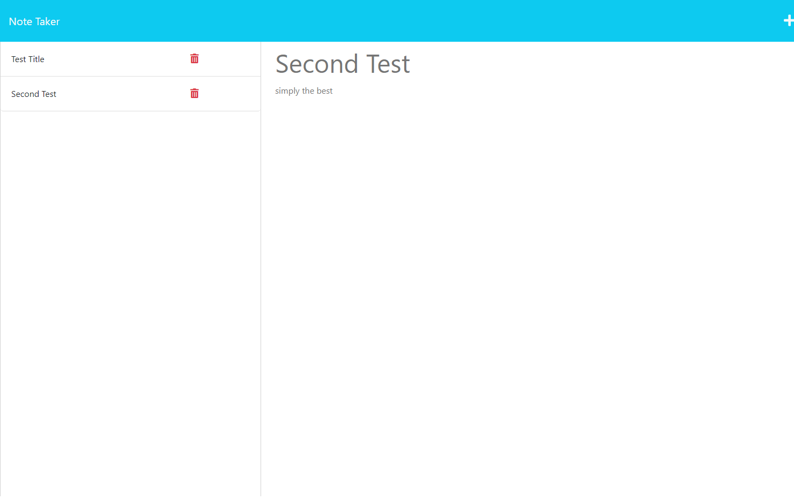

# **Module 11 Challenge:** Note Taker

## Description

The goal of this project was to use the Express package in node to create routing that would enable the user to post and get notes to and from the site. Along with Express, the fs and uuid packages were used, as well as some helper functions from the mini-project folder of Module 11. Express handled the routing, fs was used to read and write to a db.json file that stored the information in the notes, uuid helped to add ids to the notes for differentiation purposes, and the helper functions aided with syntactic sugar. 

Due to time constraints and other logistical issues, the delete route stretch goal was cut from the project.

## Preview

The project can be found at [this address](https://zack-module-11-note-taker-d50afde675f5.herokuapp.com/).

The following screenshot provides an example of how the page may look when viewing notes:
